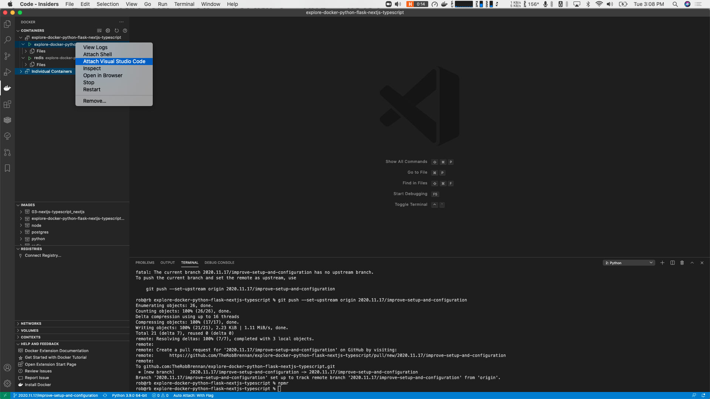

This project explores working with [Next.js](https://nextjs.org), [TypeScript](https://www.typescriptlang.org), [Storybook](https://storybook.js.org), and [Cypress](https://www.cypress.io) within a Docker environment for local development.

# Local development

To develop this application on your machine, you will need to have Docker and `docker-compose` installed.

If you are unfamiliar with Docker, don't panic. You can download and install [Docker Desktop](https://www.docker.com/products/docker-desktop) - available for macOS and Windows.

If you have [Node.js](https://nodejs.org/en/) installed on your system, you'll be able to run scripts in `package.json` with `npm run <script-name>` - such as `npm run start:clean`

If you don't have [Node.js](https://nodejs.org/en/) or `npm` installed, you can run the `docker-compose` commands directly. For example, instead of `npm run start:clean`, you would use `docker-compose up --build` instead to start the application.

Once you have started your application:

- The Next.js example is available at [http://localhost:3000](http://localhost:3000)
  - If you run `npm run storybook`, the [Storybook](https://storybook.js.org) application will be available at [http://localhost:6006](http://localhost:6006) - which is a great tool for visually exploring and interacting with your React components outside of the [Next.js](https://nextjs.org) application 🤓
- [Cypress](https://www.cypress.io) will execute all of the E2E tests to verify the app is working as expected
  - These tests can be viewed at [./apps/cypress/cypress/integration](./apps/cypress/cypress/integration)
  - Once your application has started, you will need to run these tests against the Docker container with `npm run test:e2e`.
    - Alternatively, you can also run the end-to-end (E2E) tests with [Cypress](https://www.cypress.io) locally with `npm run test:e2e:open` - which will launch the [Cypress](https://www.cypress.io) test runner and an instance of Google Chrome on your computer. Just make sure that you have installed the modules in `./apps/cypress` by running `npm install` 🤓

## Testing

We have a variety of tests available in this project:

- [Next.js](https://nextjs.org)
  - Our unit and integration tests use [Jest](https://jestjs.io) and [Enzyme](https://enzymejs.github.io/enzyme/).
  - Our end-to-end (E2E) tests use [Cypress](https://www.cypress.io) and are self-contained within the `apps/cypress` directory

Once you have started your application, you can run both the [Next.js](https://nextjs.org) unit and integration tests with `npm run test` - which executes the tests within an already-running [Next.js](https://nextjs.org) Docker container.

The end-to-end (E2E) tests with [Cypress](https://www.cypress.io) can be run against the Docker container with `npm run test:e2e` - which will restart the [Cypress](https://www.cypress.io) container to ensure the latest testing environment is loaded before executing the test suite.

For the best experience, you can also run the end-to-end (E2E) tests with [Cypress](https://www.cypress.io) locally with `npm run test:e2e:open` - which will launch the [Cypress](https://www.cypress.io) test runner and an instance of Google Chrome on your computer.

## Scripts

This project also contains several scripts to simplify developing your application.

The following scripts are in `package.json` for convenience:

- `analyze` - This builds the [Next.js](https://nextjs.org) application and generates two visual representations to explore and view the bundle sizes of the client application and server-side application
- `start` - This launches the Dockerized application - all services defined in `./docker-compose.yml` - and can be enhanced to launch additional client apps as desired.
- `start:clean` - This starts the entire Dockerized application - all services defined in `./docker-compose.yml` - with freshly built Docker images
- `stop` - This stops all services defined in `./docker-compose.yml`
- `destroy` - This removes all stopped containers (services) as defined in `./docker-compose.yml`
- `destroy:global`
  - **WARNING: This removes all unused Docker containers, networks, volumes, and images not referenced by any containers on your system - including those that may have been created in other projects. Be careful!**
- `storybook` - Assuming you have your Docker containers running, this script will start the Storybook application within the Next.js Docker container. Your Storybook application will be available at [http://localhost:6006](http://localhost:6006)
- `storybook:build` - Assuming you have your Docker containers running, this script will build the static version of the Storybook application within the Next.js Docker container.
- `storybook:publish` - This script will publish the Storybook application to [Chromatic](https://www.chromatic.com/)
  - **WARNING: This script must have your application and its dependencies installed locally in order to run!**
- `test` - Assuming you have your Docker containers running, this script will run the Next.js tests within the Next.js Docker container.
- `test:coverage` - Assuming you have your Docker containers running, this script will run the `test:nextjs:coverage` tests within the Next.js Docker container.
- `test:watch` - Assuming you have your Docker containers running, this script will run the test:nextjs:coverage tests within the Next.js Docker container.
- `test:e2e` - This will launch our end-to-end (E2E) suite of tests; currently consisting of [Cypress](https://www.cypress.io) tests.
- `test:e2e:flaps` - This will launch our end-to-end (E2E) flap tests; currently `test:e2e:cypress:flaps`
- `test:e2e:cypress` - This will launch [Cypress](https://www.cypress.io) locally from your development machine.
- `test:e2e:cypress:flaps` - This will build a fresh [Cypress](https://www.cypress.io) service and then run the script to check a single test file for flaps.
- `test:nextjs` - Assuming you have your Docker containers running, this command will connect to the [Next.js](https://nextjs.org) container and run the test suite
- `test:nextjs:coverage` - Assuming you have your Docker containers running, this command will connect to the [Next.js](https://nextjs.org) container to run the test suite and generate a code coverage report.
- `test:nextjs:watch` - Assuming you have your Docker containers running, this command will connect to the [Next.js](https://nextjs.org) container to run Jest in --watchAll mode. This will re-run your tests every time a file is changed.

Additional scripts have been created to explore and follow along the official [Create a Next.js App](https://nextjs.org/learn/basics/create-nextjs-app) tutorial:

- `nextjs-blog:build` - This stops any running services and destroys containers before performing a fresh build of the project.
- `nextjs-blog:start` - This launches the Dockerized application.
- `nextjs-blog:start:clean` - This starts the entire Dockerized application with freshly built Docker images
- `nextjs-blog:stop` - This stops all services
- `nextjs-blog:destroy` - This removes all stopped containers (services)
- `nextjs-blog:destroy:global` - **WARNING: This removes all unused Docker containers, networks, volumes, and images not referenced by any containers on your system - including those created in other projects. Be careful!**

## Visual Studio Code

If you are using [VS Code](https://code.visualstudio.com), suggested extensions for [VS Code](https://code.visualstudio.com) are available for you at `.vscode/extensions.json` - all you need to do is click on `Extensions` in the left sidebar and search for `@recommended`

### Debugging

If you are using [VS Code](https://code.visualstudio.com), you can debug this application by:

- Installing the [Docker for Visual Studio Code](https://marketplace.visualstudio.com/items?itemName=ms-azuretools.vscode-docker) extension to attach [VS Code](https://code.visualstudio.com) to a running Docker container

#### Attaching VS Code to a running Docker container

To debug your application by attaching [VS Code](https://code.visualstudio.com) to a running Docker container:

- Make sure your application is running within the Dockerized environment (see `Local development` above)
- Click on `Docker` in the left sidebar, right-click on the container you wish to debug, and select `Attach Visual Studio Code`
  
- Run the debugger with your desired launch configuration and enable breakpoints to your heart's content.

With VS Code running within your Docker container, you are free to do whatever you'd like. Any changes you make to the code will be reflected in your local directory thanks to the volume mapping we have defined in `.docker-compose.yml`
