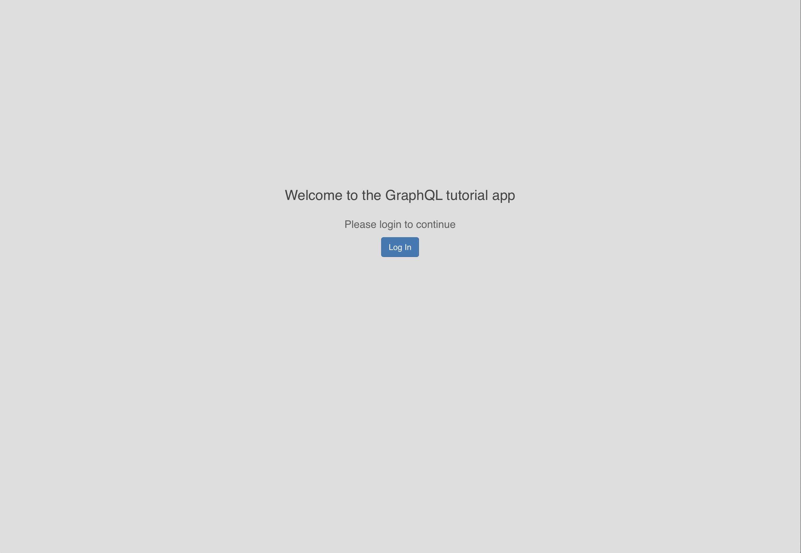
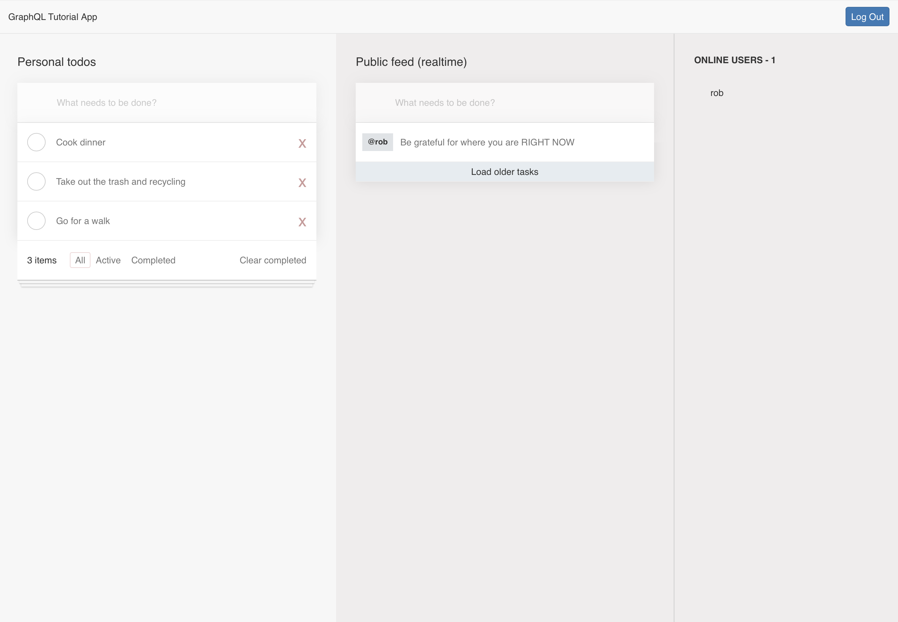
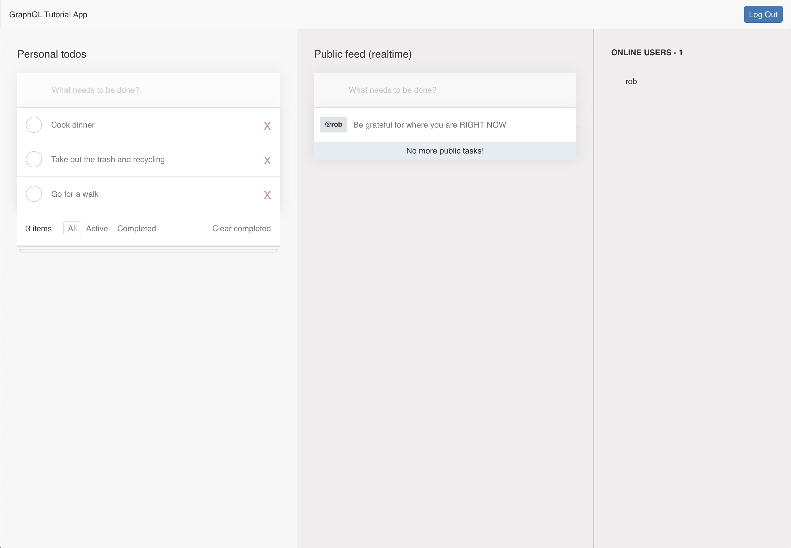
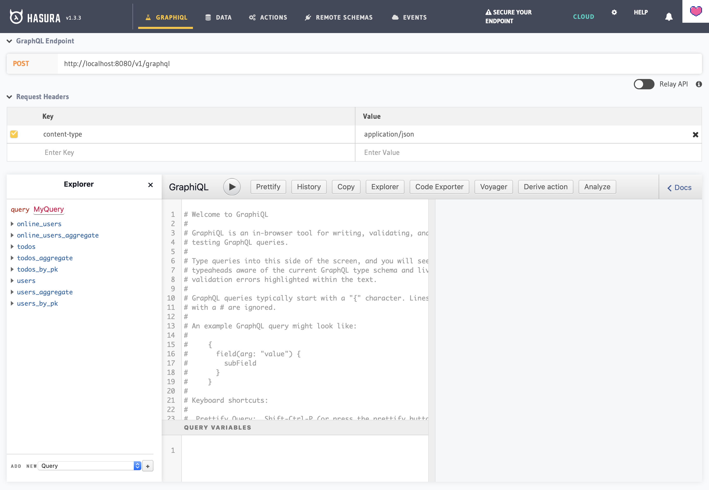

This folder contains examples exploring using [Hasura Cloud](https://hasura.io/cloud/) with a [PostgreSQL database](https://www.heroku.com/postgres) hosted on [Heroku](https://www.heroku.com/postgres).

# Local development

To develop this application on your machine, you will need to have Docker and `docker-compose` installed.

If you are unfamiliar with Docker, don't panic. You can download and install [Docker Desktop](https://www.docker.com/products/docker-desktop) - available for macOS and Windows.

## Initial setup and configuration

If you would like to work with this example in its entirety, you will need to configure [Hasura Cloud](https://hasura.io/cloud/) - perhaps by creating a new project and using a free [PostgreSQL database](https://www.heroku.com/postgres) on [Heroku](https://www.heroku.com/postgres) - as well as configure [Auth0](https://auth0.com) in order for this example to work.

First, we can configure Auth0 to create:

- An Auth0 tenant
- An Auth0 application
- An Auth0 API
- Custom claims in Auth0 rules

## Create Auth0 Application

- Navigate to the [Auth0 Dashboard](https://manage.auth0.com/)
- Signup / Login to the account
- Create a new tenant.
- Click on the `Applications` menu option on the left and then click the `+ Create Application` button.
- In the Create Application window, set a name for your application and select `Single Page Web Applications`. (Assuming the frontend app will be an SPA built on react/vue etc)
- In the `settings` of the application, we will add appropriate URLs as `Allowed Callback URLs`, `Allowed Logout URLs`, and `Allowed Web Origins`. We can also add domain specific URLs as well for the app to work. (e.g: https://myapp.com/callback).
  - `Allowed Callback URLs` - `http://localhost:3000/callback, http://localhost:3000/api/callback`
  - `Allowed Logout URLs` - `http://localhost:3000/, http://localhost:3000/callback, http://localhost:3000/api/callback, http://localhost:3000/api/logout`
  - `Allowed Web Origins` - `http://localhost:3000/callback`

This would be the URL of the frontend app which you will deploy later. You can ignore this, for now. You can always come back later and add the necessary URLs.

## Create Auth0 API

We need to create an API on Auth0 so that we can make the accessToken a valid JWT.

- Navigate to the [Auth0 Dashboard](https://manage.auth0.com/)
- Signup / Login to the account
- Click on the `APIs` menu option on the left and then click the `+ Create API` button.


Now in the pop-up that appears, give the name of the API and the identifier. We can technically give any value.

Let's say the name is `hasura` and the identifier is `https://hasura.io/learn`.


We can let the signing algorithm to be as it is. (RS256)

Click on `Create` once you are done.

NOTE: Be sure that you have added `http://localhost:3000/api/callback` or other appropriate callback URLs to your application

## Custom Claims in Auth0 Rules

[Custom claims](https://auth0.com/docs/scopes/current/custom-claims) inside the JWT are used to tell Hasura about the role of the caller, so that Hasura may enforce the necessary authorization rules to decide what the caller can and cannot do. In the Auth0 dashboard, navigate to [Rules](https://manage.auth0.com/#/rules) and click `+ Create Rule`. Select `</> Empty Rule` as the template

Add the following rule to add our custom JWT claims under `hasura-jwt-claim`:

```js
function (user, context, callback) {
  const namespace = "https://hasura.io/jwt/claims";

  context.accessToken[namespace] =
    {
      'x-hasura-default-role': 'user',
      // do some custom logic to decide allowed roles
      'x-hasura-allowed-roles': ['user'],
      'x-hasura-user-id': user.user_id
    };
  callback(null, user, context);
}
```

## Connect Hasura with Auth0

In this part, you will learn how to connect Hasura with the Auth0 application that you just created in the previous step.

We need to configure Hasura to use the Auth0 public keys. An easier way to generate the config for JWT is:

- Click on the following link - [https://hasura.io/jwt-config](https://hasura.io/jwt-config)
- For `Select Provider` choose `Auth0`
- Enter `Auth0 Domain Name` (e.g. `demo-concourse.us.auth0.com` for the `demo-concourse` tenant)
- Click `Generate Config`

The generated configuration can be used as the value for environment variable `HASURA_GRAPHQL_JWT_SECRET`.

Since we have deployed Hasura GraphQL Engine on Heroku, let's head to Heroku dashboard to configure the admin secret and JWT secret.

Open the "Settings" page for your Heroku app, add a new Config Var called `HASURA_GRAPHQL_JWT_SECRET`, and copy and paste the generate JWT configuration into the value box.

Next, create a new Config Var called `HASURA_GRAPHQL_ADMIN_SECRET` and enter a secret key to protect the GraphQL endpoint. (Imagine this as the password to your GraphQL server).

Great! Now your Hasura GraphQL Engine is secured using Auth0.

## Sync Users with Rules

Auth0 has rules that can be set up to be called on every login request. We need to set up a rule in Auth0 which allows the users of Auth0 to be in sync with the users in our database. The following code snippet allows us to do the same. Again using the Rules feature, create a new blank rule `upsert-user` and paste in the following code snippet:

```js
function (user, context, callback) {
  const userId = user.user_id;
  const nickname = user.nickname;

  // Modify with your Hasura admin secret and URL to the application
  const admin_secret = "myhasura";
  const url = "https://demo-hc-spike.hasura.app/v1/graphql";

  // Define your GraphQL mutation and query variables object
  const query = `mutation($userId: String!, $nickname: String) {
    insert_users(objects: [{
      id: $userId, name: $nickname
    }], on_conflict: {constraint: users_pkey, update_columns: [last_seen, name]}
    ) {
      affected_rows
    }
  }`;
  const variables = { "userId": userId, "nickname": nickname };

  request.post({
      url: url,
      headers: {'content-type' : 'application/json', 'x-hasura-admin-secret': admin_secret},
      body: JSON.stringify({
        query: query,
        variables: variables
      })
  }, function(error, response, body){
       console.log(body);
       callback(null, user, context);
  });
}
```

Note: Modify `admin_secret` and `url` parameters appropriately according to your app. Here we are making a simple request to make a mutation into users table.

That’s it! This rule will now be triggered on every successful signup or login, and we insert or update the user data into our database using a Hasura GraphQL mutation.

The above request performs a mutation on the users table with the id and name values.

Then, we need to:

- Update our Hasura configuration file - `__reference__/hasura-cloud-spike/config.yaml` to refer to our new Hasura Cloud application:

  ```yml
  endpoint: https://demo-hc-spike.hasura.app
  ```

- Define our environment variables - See `## Environment variables` below
- Start our application - See `## Start the application` below

  - In another terminal window, you will need to run the database migration script - either `npm run hasura:db:migrate` from the top level, or `npm run db:migrate` from this folder - to create your database.

Once you complete the `## Environment variables` and `## Start the application`, please return to the guide to see how to:

- Connect an external Hasura API with Auth0
- Sync Users with Rules

## Environment variables

Please copy `./app/.env.example` to `./app/.env` before you define the appropriate environment variables.

As of this writing, current environment variables that need to be defined for the Next.js example app include:

```sh
DOMAIN=http://localhost:3000

# These GraphQL endpoints must be externally accessible
GRAPHQL_WEB_ENDPOINT=https://demo-hc-spike.hasura.app/v1/graphql
GRAPHQL_WEBSOCKET_ENDPOINT=wss://demo-hc-spike.hasura.app/v1/graphql

# Auth0 API
AUTH0_AUDIENCE=https://hasura.io/learn

# Auth0 Application
AUTH0_DOMAIN=myapp.us.auth0.com
AUTH0_CLIENT_ID=
AUTH0_CLIENT_SECRET=
REDIRECT_URI=http://localhost:3000/api/callback
POST_LOGOUT_REDIRECT_URI=http://localhost:3000/
SESSION_COOKIE_SECRET=BXyv4qDtBKYxJtLopfY7nj75sJg3p2Ka

# Hasura Cloud environment variables - Generate the JWT secret by visiting https://hasura.io/jwt-config/
HASURA_GRAPHQL_ADMIN_SECRET=myhasura
HASURA_GRAPHQL_JWT_SECRET='{"type": "RS512", "key": "-----BEGIN CERTIFICATE-----\nYOUR-CERTIFICATE\n-----END CERTIFICATE-----"}'
```

## Start the application

Before starting the application, please make sure that you have defined your environment variables (see `Environment variables` above) as directed.

If you have [Node.js](https://nodejs.org/en/) installed on your system, you'll be able to run scripts in `package.json` with `npm run <script-name>` - such as `npm run start:clean`

If you don't have [Node.js](https://nodejs.org/en/) or `npm` installed, you can run the `docker-compose` commands directly. For example, instead of `npm run start:clean`, you would use `docker-compose up --build` instead to start the application.

Once you have started your application:

- The Next.js web application with [Hasura](https://hasura.io), [Apollo](https://www.apollographql.com), and [Auth0](https://auth0.com) is available at [http://localhost:3000](http://localhost:3000)







Please login to your dashboard on [Hasura Cloud](https://hasura.io/cloud/) to view the Hasura console.

### Scripts

This project also contains several scripts to simplify developing your application.

The following scripts are in `package.json` for convenience:

- `build` - This stops any running services and destroys containers defined in `./docker-compose.yml` before performing a fresh build of the project.
- `start` - This launches the Dockerized application - all services defined in `./docker-compose.yml` - and can be enhanced as desired.
- `start:clean` - This starts the entire Dockerized application - all services defined in `./docker-compose.yml` - with freshly built Docker images
- `stop` - This stops all services defined in `./docker-compose.yml`
- `db:migrate` - This runs database migrations defined in `./migrations` against the Hasura endpoint specified in `./config.yaml`
  - After running `db:migrate`, your Hasura console should look like:
    
- `destroy` - This removes all stopped containers (services) as defined in `./docker-compose.yml`
- `destroy:global` - **WARNING: This removes all unused Docker containers, networks, volumes, and images not referenced by any containers on your system - including those created in other projects. Be careful!**

# Resources

## Documentation

[Hasura Cloud Documentation](https://hasura.io/docs/1.0/graphql/cloud/index.html)

## Tutorials

[Introduction to setting up a GraphQL back-end with Hasura](https://hasura.io/learn/graphql/hasura/introduction/)

[Introduction to using Next.js with Hasura and Apollo](https://hasura.io/learn/graphql/nextjs-fullstack-serverless/introduction/)

[Learn Hasura and GraphQL](https://hasura.io/learn/)

- Frontend GraphQL Tutorials using a variety of supported frameworks (React, Vue, Next.js, TypeScript, Angular, iOS, and many more)
- Hasura back-end tutorials
- Introduction to GraphQL
