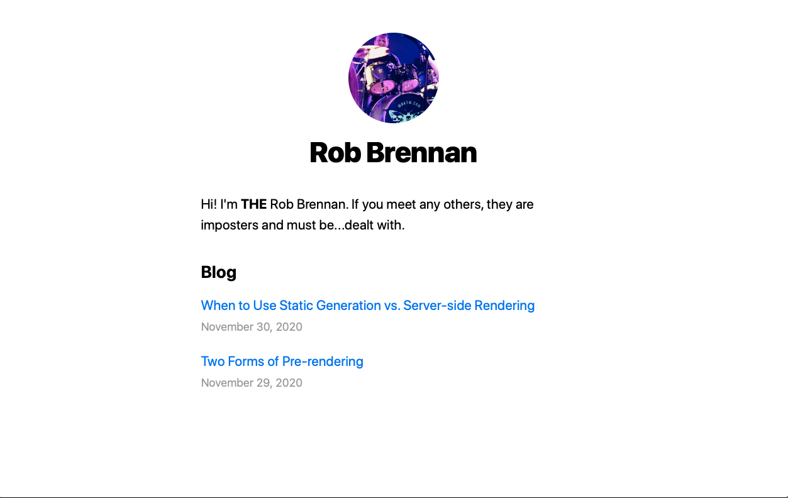

This example is based on the official [Create a Next.js App](https://nextjs.org/learn/basics/create-nextjs-app) created by [Next.js](https://nextjs.org/).

# Getting started

This is an example [Next.js](https://nextjs.org/) app which uses [TypeScript](https://www.typescriptlang.org) as well as blog posts written as [Markdown](https://www.markdownguide.org) text files.



DEMO: [https://concourse-nextjs-blog.vercel.app](https://concourse-nextjs-blog.vercel.app)

## Cheat sheet

The following commands were executed while following along with the [Create a Next.js App](https://nextjs.org/learn/basics/create-nextjs-app) tutorial:

```sh
# Make sure that we are in the /apps/nextjs-blog directory before creating our example app
$ cd apps/nextjs-blog

# Create a Next.js app that will exist under the /apps/nextjs-blog/app directory
$ npx create-next-app app --use-npm --example "https://github.com/vercel/next-learn-starter/tree/master/learn-starter"
```
