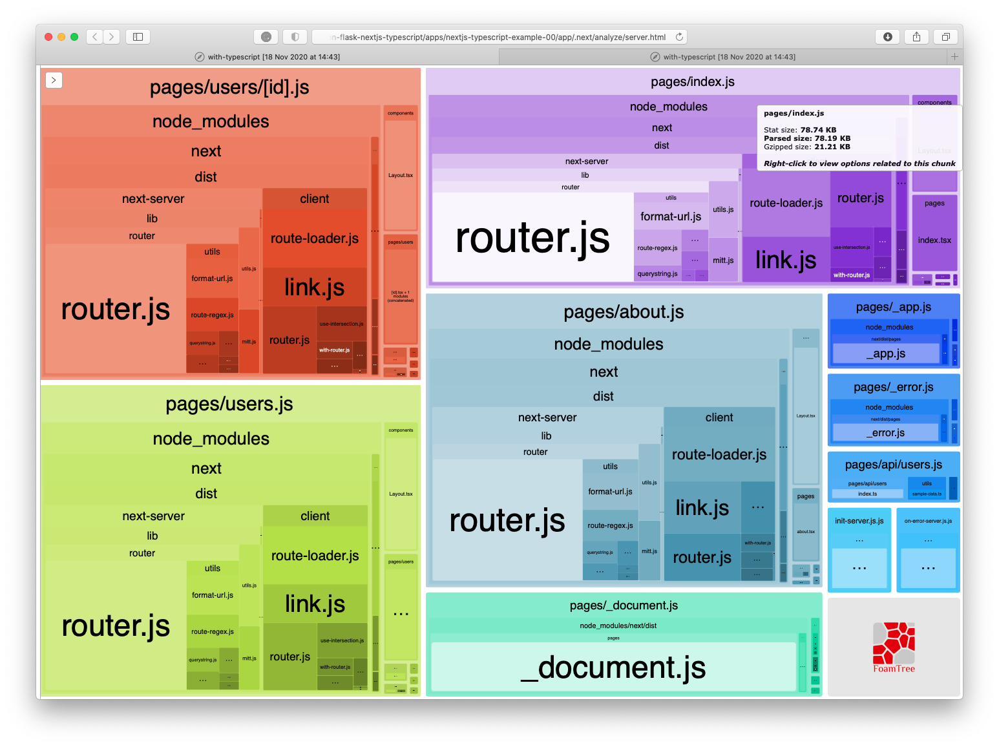
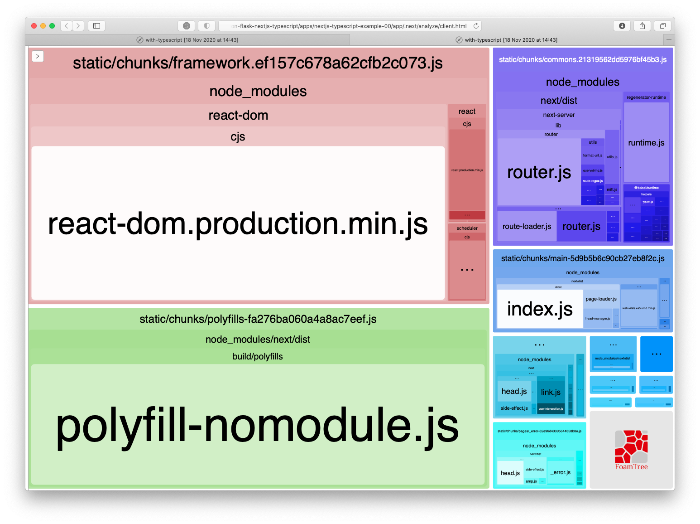

# Getting started

For this project, we are going to be using [create-next-app](https://nextjs.org/docs/api-reference/create-next-app) to generate a [Next.js](https://nextjs.org) app that uses [TypeScript](https://www.typescriptlang.org).

# Local development

To develop this application on your machine, you will need to have Docker and [Node.js](https://nodejs.org/en/) installed.

If you are unfamiliar with Docker, don't panic. You can download and install [Docker Desktop](https://www.docker.com/products/docker-desktop) - available for macOS and Windows.

Quick cheat sheet for working with this Dockerized app:

```sh
# ----------------------------------------------------------------------- #
#                     Docker compose cheatsheet                           #
# ----------------------------------------------------------------------- #
# Created by Rob Brennan <rob@therobbrennan.com>                          #
# ----------------------------------------------------------------------- #

# Start the application
#   NOTE: This will build new images/containers the first time; otherwise,
#         it will reuse containers if they exist.
$ docker-compose up

# Start the application after a fresh build of new images and containers
$ docker-compose up --build

# Stop the application
#   NOTE: This stops Docker services/containers for this application but
#         does NOT destroy or remove them
$ docker-compose stop

# Remove stopped service containers and any anonymous volumes
# that are attached to the containers
$ docker-compose rm -f -v

# Remove all unused containers, networks, volumes, and images not referenced
# by any containers
$ docker system prune -f --volumes && docker image prune -a -f
# ----------------------------------------------------------------------- #
```

## Create a Next.js app using TypeScript

We will use the latest version of [create-next-app](https://nextjs.org/docs/api-reference/create-next-app) to generate our [Next.js](https://nextjs.org) app with [TypeScript](https://www.typescriptlang.org) automatically configured for us:

```sh
$ npx create-next-app app --example with-typescript
```

Let's verify that our app runs by starting Next.js in development mode:

```sh
$ cd app
$ npm run dev
```

Your application should be available at [http://localhost:3000](http://localhost:3000) 🤓

### Environment variables

Please copy `./app/.env.local.sample` to `./app/.env` and then define the appropriate environment variables.

If you are running the app within the Dockerized environment, please make sure that you have the Python Flask API pointing to the Docker service name of your application (e.g. `python-flask` in `docker-compose.yml`):

```sh
# You must use NEXT_PUBLIC_ as a prefix if you'd like to make environment variables explicitly available to the web browser in a Next.js application
# https://nextjs.org/docs/basic-features/environment-variables#exposing-environment-variables-to-the-browser
NEXT_PUBLIC_FLASK_API="http://python-flask:5000/api/hello-world"
```

## Scripts

This project also contains several scripts to simplify developing your application.

The following scripts are in `package.json` for convenience:

- `analyze` - This builds the Next.js application and generates two visual representations to explore and view the bundle sizes of the client application and server-side application





- `start` - This launches the Dockerized application - all services defined in `./docker-compose.yml` - and can be enhanced to launch additional services as desired.
- `start:clean` - This starts the entire Dockerized application - all services defined in `./docker-compose.yml` - with freshly built Docker images
- `stop` - This stops all services defined in `./docker-compose.yml`
- `destroy` - This removes all stopped containers (services) as defined in `./docker-compose.yml`
- `destroy:global` - **WARNING: This removes all unused Docker containers, networks, volumes, and images not referenced by any containers on your system - including those that may have been created in other projects. Be careful!**
